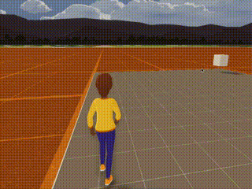

# DEPRECATED
This repo no longer works as the teleport functions were updated. This method of teleporting (transforming mutable player position) no longer works.

New way of teleporting a player inside the scene in DCL SDK7:

https://docs.decentraland.org/creator/development-guide/sdk7/move-player/

# SDK7 Test scene - Teleport

This scene is built with the SDK7 in alpha state.
Testing a teleport system

